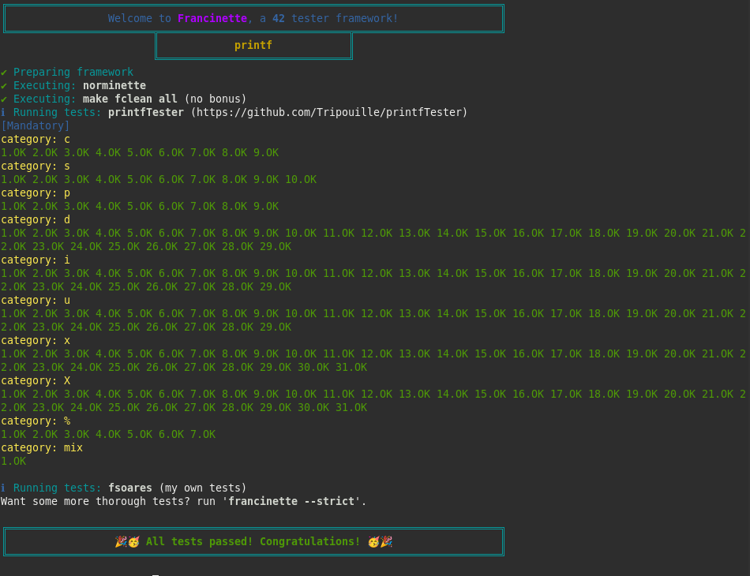

  <!-- Logo -->
  

  <!-- Project Name -->
  <h1>ft_printf</h1>

  <!-- Short Description -->
  <h3>42 Porto ft_printf</h3>
 

  <!-- Badges -->
  

    
    
    
    
    
    
  

  <!-- Tree -->
<h4>
    <a href="https://github.com/knoxvillie/ft_printf" target="_blank">:large_blue_diamond: View Demo</a>
   · 
    <a href="https://github.com/knoxvillie/ft_printf/issues" target="_blank">:beetle: Report Bug</a>
   · 
    <a href="https://github.com/knoxvillie/ft_printf/issues" target="_blank">:speech_balloon: Request Feature</a>
</h4>

  <!-- Subject -->
 
  <a href="subject.pdf"><strong>Explore the Subjetc »</strong></a>
 
 

  <h2>:star2: About The Project</h2>
  

   The goal of the project is to create a script that receives a file descriptor and reads a predefined amount of bytes <em>BUFFER_SIZE</me>, until the end of a line is reached. When the number of bytes in the line is not a multiple of <em>BUFFER_SIZE</me>, the read function will read bytes that do not belong to the line in question, but to the next line. As a result, this project reads and returns one line at a time from a file descriptor, whenever the get_next_line function is executed.
  The bonus part handles multiple text files simultaneously.
  

<h2>:dart: Table of Contents</h2>

- [x] Mandatory Part
    - [x] Makefile
    - [x] ft_printf.h
    - [x] .c Files    
        - [x] ft_printf 
        - [x] ft_checkspecifier
        - [x] ft_printfc
        - [x] ft_printfd
        - [x] ft_printfp
        - [x] ft_printfs
        - [x] ft_printfs
        - [x] ft_printfu
        - [x] ft_printfx
   
- [ ] Bonus Part
    - [ ] Makefile
    - [ ] Header
        - [ ] .c files

 <!-- Contributing -->
<h2>:wave: Contributing</h2>
 
Contributions are what make the open source community such an amazing place to learn, inspire, and create. Any contributions you make are greatly appreciated.

If you have a suggestion that would make this better, please fork the repo and create a pull request. You can also simply open an issue with the tag "enhancement".
Don't forget to give the project a star! Thanks again!

1. Fork the Project
2. Create your Feature Branch (`git checkout -b feature/AmazingFeature`)
3. Commit your Changes (`git commit -m 'Add some AmazingFeature'`)
4. Push to the Branch (`git push origin feature/AmazingFeature`)
5. Open a Pull Request

<h2 align="center">:wrench: Running Tests</h2>
<h4 align="center">
 · 
  <a href="https://github.com/xicodomingues/francinette" target="_blank">:paperclip: Francinette</a>
 · 
 
 
</h4>
<h3 align="center">:camera: Screenshots</h3>

  
  

(<a href="#readme-top">back to top</a>)

